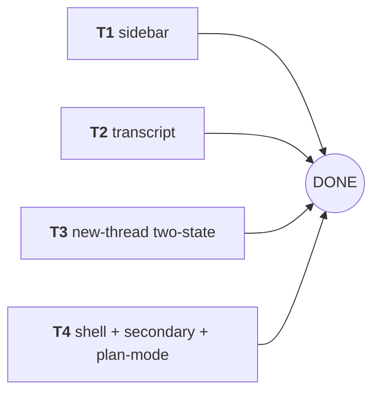

# Frontend Relayout — Task Decomposition

Date: 2026-08-15 · Area: `vendor/pi-gui/apps/desktop` (visual/layout only, per requirements.md)
Execution form: **batch** — all tasks are Level 1 and run in parallel (disjoint files).

## Repo facts (verified by reading source, 2026-08-15)

- There is **no `composer.css`** (requirements.md assumed one). Composer + secondary-surface + settings/skills/extensions styles all live in `styles/main.css` (composer block ~L714–1123, secondary-surface ~L1125–1223, settings ~L1615–1920, skills/extensions ~L1995–2160). `new-thread.css` (142 lines) is separate.
- `styles/tokens.css` + `styles/base.css` already carry the 03b Warm Paper Sharp system (radii 0–4px, terracotta accent, serif fonts, `--radius-pill` reserved for dots). **Token work is DONE** — this plan restyles selectors onto existing tokens, no new tokens needed.
- `.session-row--active` (sidebar.css:518–524) **already matches the demo** (2px accent left border + surface-overlay bg + shadow-sm). `.workspace-row--active` (244–249) likewise. Active-row treatment = verify only, no change.
- Thinking block (`.timeline-thinking*`, timeline.css:589–650) already has the 120px fixed scroll body + mono 11px muted-soft pre. Only the collapsed **header** needs the pill/chip treatment.
- Tool group (`.timeline-tool-group*`, timeline.css:654–715) and `TimelineToolGroupItem` (timeline-item.tsx:368–431) exist; the group is currently a **bare grid** (no card shell) — restyle to a card.
- New-thread composer is **single-row only today**: `composer-surface.tsx:339–357` renders `[leadingControls] <textarea> [trailingControls]` in `.composer__editor-row` (flex row). `new-thread-view.tsx:112–120` already auto-grows the textarea via inline `style.height` on every prompt change — **the two-state toggle piggybacks on this exact effect**; no other JS change is needed.
- New-thread Enter behavior (`use-new-thread-controller.tsx:307–319`): plain Enter = submit (`startThread`), Shift+Enter = newline. **The demo's "manual Enter" maps to Shift+Enter in the real app**; plain-Enter submit is behavior and stays untouched.
- `--surface-2` is referenced by `jovaltus.css:186` (`.jovaltus-graph__batch`) but is **not defined in any real token file** (only the demo defines it) → that background is currently invalid/transparent. Fix: `var(--surface-muted)`.
- `--theme-bubble-bg` is theme-preset-controlled (theme-presets.ts) and falls back in timeline.css:283; bubble restyle must keep the `var(--theme-bubble-bg, …)` override and only change the fallback + shadow/width.
- Topbar (topbar.css + topbar.tsx) **already implements** breadcrumb `workspace / separator / session` and icon buttons with kbd shortcut hints (hover tooltips) — no changes needed, verify only (FR-2).
- `.view-header__title` (main.css:1655–1662) already serif; bump size only.
- Jovaltus execute panel + graph popup fully implemented (jovaltus-ui.tsx) and mostly styled; only the diffs in T4 apply.
- Secondary-surface shell (secondary-surface.tsx) matches the demo structurally; only the title + active-nav treatment differ.

## Manifest

```yaml
- id: T1
  title: Sidebar — group labels + counts, active rows, nav/new styling
  description: >-
    Restyle the sidebar to the demo's group-label language using existing
    classes only. Add the Pinned count span (visual-only TSX, mirrors the
    existing Archived count). Active rows already match the demo (verify,
    do not touch). Tags: FR-1, AC-1, AC-5, AC-8.
  files:
    - vendor/pi-gui/apps/desktop/src/styles/sidebar.css
    - vendor/pi-gui/apps/desktop/src/sidebar.tsx
  deps: []
  level: 1
- id: T2
  title: Transcript — user bubble, thinking chip, tool-group card, per-tool rows
  description: >-
    Restyle timeline.css to the demo: right-aligned user bubble with surface
    bg + shadow + 62% cap (keep --theme-bubble-bg override), dashed mono
    thinking chip on the existing .timeline-thinking__header, card shell for
    .timeline-tool-group with header strip + per-tool rows (icon chip, mono
    name, detail, status). CSS-only; no TSX changes (no avatar added).
    Tags: FR-3, FR-4, FR-5, AC-1, AC-3, AC-5, AC-8.
  files:
    - vendor/pi-gui/apps/desktop/src/styles/timeline.css
  deps: []
  level: 1
- id: T3
  title: New-thread two-state composer (the only JS change) + hero
  description: >-
    Add the wrapped two-state composer: extend the existing auto-grow effect
    in new-thread-view.tsx to flip a useState flag (wrapped = scrollHeight >
    36px OR prompt contains a newline), apply the class
    new-thread__composer--wrapped on the .new-thread__composer div, and add
    wrapped-state CSS scoped in new-thread.css (textarea full row + controls
    wrap below). Also bump composer width 820→860px and hero title 30→44px.
    Plain-Enter submit logic is NOT touched. Tags: FR-7, AC-1, AC-2, AC-5, AC-8.
  files:
    - vendor/pi-gui/apps/desktop/src/styles/new-thread.css
    - vendor/pi-gui/apps/desktop/src/new-thread-view.tsx
  deps: []
  level: 1
- id: T4
  title: Shell & secondary surfaces & plan-mode — composer shell, execute
    panel, graph popup, settings/skills/extensions
  description: >-
    Restyle main.css + jovaltus.css: composer shell (solid bg, line-strong
    border, shadow-md), execute panel as a strip (no box), graph popup
    column nodes + mono labels, fix --surface-2 -> --surface-muted, serif
    secondary-surface title + 2px accent active nav, serif view-header bump,
    settings-grid max-width 780px, skills single-column card list + serif
    detail title, skill-card accent active ring. Topbar: verify only (FR-2).
    Tags: FR-2, FR-6, FR-8, AC-1, AC-4, AC-5, AC-6, AC-7, AC-8.
  files:
    - vendor/pi-gui/apps/desktop/src/styles/main.css
    - vendor/pi-gui/apps/desktop/src/styles/jovaltus.css
  deps: []
  level: 1
```

## Dependency DAG



**Batch table** — Level 1 (parallel): T1, T2, T3, T4 · Level 2: (none)

All tasks share one tree, so same-level disjointness holds at the file level
(see Manifest `files`). Reads are free; every worker may read any file.

---

## Pinned API / class contract (canonical names — do not invent others)

The demo uses simplified class names; the real app's classes below are
canonical and each task must use ONLY these (they already exist in the
components; no component renames, no duplicate structures):

| Task | Canonical classes (existing)                                                                                                                                                                                                                                   | New class (allowed)                                                         | Must NOT touch                                                                                                                                                                   |
| ---- | -------------------------------------------------------------------------------------------------------------------------------------------------------------------------------------------------------------------------------------------------------------- | --------------------------------------------------------------------------- | -------------------------------------------------------------------------------------------------------------------------------------------------------------------------------- |
| T1   | `.sidebar__nav-item`, `--active`, `.sidebar__new`, `.pinned-thread-group__head`, `.archived-thread-group__toggle`, `__count`, `.session-row--active`, `.workspace-row--active`, `.section__head`, `.sidebar__footer`, `.sidebar__settings`                     | `.pinned-thread-group__count` (styled like `.archived-thread-group__count`) | other CSS files; thread-groups.ts                                                                                                                                                |
| T2   | `.timeline-item--user`, `.timeline-item__bubble`, `.timeline-thinking__header/__body/__pre`, `.timeline-tool-group`, `__header`, `__body`, `__glyph`, `__label`, `.timeline-tool` (descendant-scoped), `.timeline-tool__status-pip`, `.timeline-tool__chevron` | none                                                                        | timeline-item.tsx; standalone `.timeline-tool` base rules (only descendant-scoped additions inside `.timeline-tool-group`)                                                       |
| T3   | `.new-thread__composer`, `.composer__editor-row`, `.composer textarea`, `.composer__attach`, `.new-thread__hero h1`, `.new-thread__workspace`                                                                                                                  | `.new-thread__composer--wrapped`                                            | `.composer__surface` and base `.composer__editor-row` rules (T4 owns those in main.css); Enter/submit logic in `use-new-thread-controller.tsx`; composer-surface.tsx child order |
| T4   | `.composer`, `.composer__surface`, `.jovaltus-execute`, `.jovaltus-graph*`, `.secondary-surface*`, `.view-header__title`, `.settings-grid`, `.settings-group`, `.skills-layout`, `.skills-grid`, `.skill-card*`, `.skill-detail*`, `.topbar*` (verify only)    | none                                                                        | `new-thread.css` / `new-thread-view.tsx`; must NOT reorder `.composer__editor-row` children (attach, textarea, controls) — T3 relies on that order                               |

Cross-task contracts:

- T3's wrapped-state rules must be **scoped under `.new-thread__composer--wrapped`** in new-thread.css and must not alter base `.composer__editor-row`/`.composer__surface` (owned by T4 in main.css). The row child order in composer-surface.tsx is `leadingControls(attach) → textarea → trailingControls(env/model/send)`; the wrapped CSS targets them via `order` + `:nth-child(n+3)`.
- T4 must not introduce any `--wrapped` handling and must not change the row child order.

---

## T1 — Sidebar: group labels + counts, active rows, nav/new styling

**Files (EDIT):** `src/styles/sidebar.css` · `src/sidebar.tsx`
**Level 1 · deps: none**

### Concrete selector diffs (current → demo target)

1. **Pinned count (TSX, 1 line, visual-only):** `PinnedThreadsSection` (sidebar.tsx:686–689) renders `<div className="pinned-thread-group__head"><PinIcon filled /><span>Pinned</span></div>`. Add `<span className="pinned-thread-group__count">{pinnedThreads.length}</span>` after the label — mirrors the existing `.archived-thread-group__count` (sidebar.tsx:623). No other TSX change in this file.
2. `.pinned-thread-group__head` (sidebar.css:471–482) — already uppercase 11px muted-subtle letter-spacing 0.08em; matches demo `.sb-group__label`. Verify only. Add `.pinned-thread-group__count` styled identically to `.archived-thread-group__count` (sidebar.css:804–806: `color: var(--muted-subtle)`). **Do NOT use a pill/999px chip** — token contract is sharp (2px max on text chips); the demo's 999px count badge is superseded by 03b.
3. `.session-row--active` (518–524) + `.workspace-row--active` (244–249) — **already match the demo** (2px accent left border + surface bg + shadow-sm). Verify by eye at 1480×980; no edit.
4. `.sidebar__new` (86–101) — currently solid `--surface-muted` + `--line` border. Demo `.sidebar__new`: `border: 1px dashed var(--line-strong)`, hover `border-color: var(--accent); color: var(--accent); background: var(--accent-tint-bg)`. Change border to dashed + add hover rule.
5. `.sidebar__nav-item--active` (80–84) — currently overlay bg + line border. Demo `.sb-nav--active`: `background: var(--surface); box-shadow: var(--shadow-sm); color: var(--accent)`. Restyle to surface bg + shadow-sm + accent ink.
6. `.section__head` (113–123) — already uppercase muted-subtle; matches demo group-label style. Verify only.
7. `.archived-thread-group__toggle` (769–806) — label + count already present. Verify only (do not restyle its radius to a pill).

### Verification (run from repo root)

```bash
pnpm --filter @pi-gui/desktop build
pnpm --filter @pi-gui/desktop typecheck
grep -n "pinned-thread-group__count" vendor/pi-gui/apps/desktop/src/sidebar.tsx vendor/pi-gui/apps/desktop/src/styles/sidebar.css   # ≥2 hits total
```

### Per-task acceptance (AC)

- AC-1: build + typecheck exit 0, 0 errors.
- AC-5: pin/unpin, archive, workspace drag, session select all behave as before (no logic touched).
- AC-8: sidebar shows Pinned header + count, per-workspace rows with the demo label styling, active row = 2px accent left border + surface bg + shadow; Archived toggle + count present. (Today/Earlier labels are a documented deviation — see Scope notes.)

---

## T2 — Transcript: user bubble, thinking chip, tool-group card, per-tool rows

**Files (EDIT):** `src/styles/timeline.css` (CSS only — no TSX)
**Level 1 · deps: none**

### Concrete selector diffs (current → demo target)

1. **User bubble** — `.timeline-item--user` (215–221) already right-aligns (`justify-content: flex-end`). Restyle `.timeline-item__bubble` (277–284):
   - `width: min(620px, 100%)` → `max-width: 62%` (demo `.msg-user__bubble`),
   - `background: var(--theme-bubble-bg, var(--main))` → fallback `var(--surface)` (**keep the `--theme-bubble-bg` override — theme-preset controlled**),
   - add `box-shadow: var(--shadow-sm)`; keep the 1px border + 4px radius (already sharp).
2. **Thinking chip (collapsed pill)** — `.timeline-thinking__header` (595–607) is currently a bare inline-flex row. Demo `.thinking-row`: mono 11px muted, dashed border, chip look. Add:
   - `font-family: var(--font-mono); font-size: 11px; color: var(--muted-strong);`
   - `border: 1px dashed var(--line-strong); padding: 3px 8px; border-radius: var(--radius-sm);` (sharp per 03b — the demo's 999px pill is superseded by the token contract; documented in Scope notes),
   - `background: transparent;` hover `border-color: var(--accent-tint-border); color: var(--accent);`
   - `.timeline-thinking__glyph` (613–621): wrap the existing 16px glyph in a small chip: `border-radius: var(--radius-sm); background: var(--surface-muted);` (demo `.thinking-row__glyph`).
   - `.timeline-thinking__body` (634–639) + `__pre` (641–650): already 120px fixed + mono 11px muted-soft — verify only.
3. **Tool-group card** — `.timeline-tool-group` (654–660) is a bare grid. Demo `.tool-group` card. Add:
   - `.timeline-tool-group { border: 1px solid var(--line); border-radius: var(--radius-xl); background: var(--surface); max-width: 680px; }`
   - `.timeline-tool-group--running { border-color: var(--accent-tint-border); }`
   - `.timeline-tool-group__header` (675–689): `padding: 8px 12px; background: var(--surface-muted);` + `:hover { background: var(--overlay-hover); }` (the header is a `<button>`, keep `flex:1` behavior).
   - `.timeline-tool-group__glyph` (691–704): chip `width: 22px; height: 22px; border-radius: var(--radius-sm); background: var(--surface-muted); color: var(--text);`
   - `.timeline-tool-group__label` (706–710): `font-family: var(--font-mono); font-size: 12px; font-weight: 600; color: var(--text-strong);`
   - `.timeline-tool-group__body` (712–715): `border-top: 1px solid var(--line);` (keep gap).
4. **Per-tool rows inside the group** — descendant-scoped so standalone `.timeline-tool` is untouched:
   - `.timeline-tool-group .timeline-tool { padding: 8px 12px; border-bottom: 1px solid var(--line); }` + `:last-child { border-bottom: 0; }`
   - `.timeline-tool-group .timeline-tool__glyph { width: 20px; height: 20px; border-radius: var(--radius-sm); background: var(--surface-muted); color: var(--text); }`
   - `.timeline-tool-group .timeline-tool__label { font-family: var(--font-mono); font-size: 12px; font-weight: 600; color: var(--text-strong); }`
   - keep `.timeline-tool__status-pip` (6px circle, `--radius-pill`) and running pulse as-is — they already match the demo status dots.
5. **Assistant block** — no avatar (documented deviation); keep `.timeline-item--assistant` (191–195) spacing. Verify only.

### Verification (run from repo root)

```bash
pnpm --filter @pi-gui/desktop build
pnpm --filter @pi-gui/desktop typecheck
grep -n "timeline-tool-group .timeline-tool" vendor/pi-gui/apps/desktop/src/styles/timeline.css   # descendant-scoped rows present
grep -c "999px\|--radius-pill" vendor/pi-gui/apps/desktop/src/styles/timeline.css   # only the 6px status dots use pill (expect only __status-pip + skeleton lines)
```

### Per-task acceptance (AC)

- AC-1: build + typecheck green.
- AC-3: user bubble right-aligned with surface bg + shadow; thinking chip expands to the 120px scroll window; tool group collapses to "Used N tools" and expands; rows show icon chip + mono name + detail + status.
- AC-5: expand/collapse, fork, copy, view-in-diff all still work (only CSS touched).
- AC-8: transcript matches the demo language at 1480×980.

---

## T3 — New-thread two-state composer (only JS change) + hero

**Files (EDIT):** `src/styles/new-thread.css` · `src/new-thread-view.tsx`
**Level 1 · deps: none — smallest possible diff; this is the ONLY behavioral addition in the whole relayout**

### Concrete changes

1. **TSX toggle (new-thread-view.tsx, ~5 lines):**
   - Import `useState` (line 1 currently imports `useEffect, useRef, …`).
   - Add `const [wrapped, setWrapped] = useState(false);` next to `fileInputRef` (line 105).
   - Extend the existing auto-grow effect (lines 112–120):
     ```ts
     composer.style.height = '0px';
     const scrollHeight = composer.scrollHeight;
     composer.style.height = `${Math.min(scrollHeight, 260)}px`;
     setWrapped(scrollHeight > 36 || prompt.includes('\n'));
     ```
     (36px = the `.composer textarea` single-line height in main.css:827–831; `prompt` already in the effect deps.)
   - Apply the class on the shell div (line 159): `className={`new-thread__composer composer${wrapped ? " new-thread__composer--wrapped" : ""}`}`.
   - **Do NOT touch** `handleComposerKeyDown` / `startThread` (use-new-thread-controller.tsx) — plain Enter still submits; Shift+Enter newline (the real-app equivalent of the demo's "manual Enter") also flips the flag via `prompt.includes("\n")`.
2. **Wrapped-state CSS (new-thread.css, all scoped under `.new-thread__composer--wrapped`):**
   ```css
   .new-thread__composer--wrapped .composer__editor-row {
     flex-wrap: wrap;
   }
   .new-thread__composer--wrapped .composer textarea {
     order: 1;
     flex-basis: 100%;
   }
   .new-thread__composer--wrapped .composer__attach {
     order: 2;
   }
   .new-thread__composer--wrapped .composer__editor-row > :nth-child(n + 3) {
     order: 3;
     margin-left: auto;
   }
   ```
   (children order is fixed by composer-surface.tsx: attach(1) → textarea(2) → env/model/send(3+); `nth-child(n+3)` = the trailing controls — matches demo `.nt-composer--wrapped` attach-left / controls-right bottom row.)
3. **Hero + shell (new-thread.css):**
   - `.new-thread__composer` (70–73): `width: min(820px, 100%)` → `min(860px, 100%)` (demo 860px).
   - `.new-thread__hero h1` (42–50): font-size `30px` → `44px` (demo), keep serif + letter-spacing.
   - `.new-thread__workspace` (61–68): add `box-shadow: var(--shadow-sm)`; keep sharp radius (demo's 999px pill is superseded — do not add `--radius-pill`).

### Verification (run from repo root)

```bash
pnpm --filter @pi-gui/desktop build
pnpm --filter @pi-gui/desktop typecheck
grep -n "new-thread__composer--wrapped" vendor/pi-gui/apps/desktop/src/styles/new-thread.css vendor/pi-gui/apps/desktop/src/new-thread-view.tsx   # ≥5 rule/class hits
git diff --stat vendor/pi-gui/apps/desktop/src/new-thread-view.tsx   # expect ≤ ~10 changed lines
```

### Per-task acceptance (AC)

- AC-1: build + typecheck green (this task touches TSX — the PBT suites need not rerun: no contract-layer file touched, per AGENTS.md).
- AC-2: single line → wrapped: (a) type past one line of width (auto-wrap) flips to wrapped; (b) Shift+Enter (newline) flips to wrapped; (c) wrapped state shows textarea on full first row with `[+]` left and env/model/send right on the bottom row; (d) clearing the prompt returns to single row; (e) plain Enter still submits.
- AC-5: submit, slash/mention menus, attachment, env/model pickers unchanged.
- AC-8: hero "Let's build" serif 44px + workspace pill + 860px composer at 1480×980.

---

## T4 — Shell & secondary surfaces & plan-mode (composer shell, execute panel, graph, settings/skills/extensions)

**Files (EDIT):** `src/styles/main.css` · `src/styles/jovaltus.css` (CSS only — no TSX)
**Level 1 · deps: none**

### Concrete selector diffs (current → demo target)

1. **Composer shell** (main.css):
   - `.composer` (714–717): `padding: 18px 28px 24px` → `12px 20px 16px`; `background: linear-gradient(180deg, transparent 0%, var(--main) 54%)` → `var(--main)` (demo `.composer-shell` solid bg).
   - `.composer__surface` (719–732): `border-color: var(--theme-control-border, var(--line))` → `var(--theme-control-border, var(--line-strong))`; `box-shadow: var(--shadow-sm)` → `var(--shadow-md)` (demo `.composer`). Keep radius 4px + drag/attach behavior.
2. **Jovaltus execute panel** (jovaltus.css) — demo renders it as a strip above the input (`.jovaltus-execute` with `border-bottom` + `background: var(--surface-3)`), not a floating box:
   - `.jovaltus-execute` (53–73): drop `border: 1px solid …; border-radius: var(--radius-md); margin-bottom: var(--space-2);` → `border: 0; border-bottom: 1px solid var(--border-default); border-radius: 0; background: var(--surface-muted); margin-bottom: 0; padding: 7px 14px;` (keep the button semantics + hover).
3. **Graph popup** (jovaltus.css) — demo: 360px, nodes stacked vertically, mono type:
   - `.jovaltus-graph` (131–139): `width: min(420px, 100vw)` → `min(360px, 100vw)`.
   - `.jovaltus-graph__title` (149–153): `font-family: var(--font-mono); font-size: 12px; letter-spacing: 0.06em; text-transform: uppercase;` (demo).
   - `.jovaltus-graph__nodes` (202–206): `flex-wrap: wrap` → `flex-direction: column; gap: 6px;` (demo column layout).
   - `.jovaltus-graph__node` (208–218): add `font-family: var(--font-mono); font-size: 11.5px;`.
   - **BUG FIX:** `.jovaltus-graph__batch` (186): `background: var(--surface-2)` → `background: var(--surface-muted)` — `--surface-2` is undefined in the real token set (only the demo defines it); the batch bg is currently invalid.
4. **Secondary surface shell** (main.css):
   - `.secondary-surface__sidebar` (1133–1140): `grid-template-columns` owner is `.secondary-surface` (1125–1131): `232px` → `208px` (demo). Sidebar bg already `var(--sidebar)` ✓.
   - `.secondary-surface__title` (1160–1167): currently tiny uppercase 11px muted — demo `.secondary__title` serif 22px strong. Restyle: `font-family: var(--font-serif); font-size: 22px; font-weight: 600; letter-spacing: -0.02em; color: var(--text-strong); padding: 4px 8px 12px;` (remove uppercase/letterspacing).
   - `.secondary-surface__nav-item` (1174–1182): `border-left: 2px solid transparent; border-radius: 0 var(--radius-lg) var(--radius-lg) 0;` (demo active-rail pattern).
   - `.secondary-surface__nav-item--active` (1190–1193): from rounded accent-tint bg → `border-left-color: var(--accent); background: var(--surface); color: var(--accent); box-shadow: var(--shadow-sm);`.
   - `.secondary-surface__back` (1142–1158) — already matches demo. Verify only.
5. **Settings / skills / extensions content** (main.css):
   - `.view-header__title` (1655–1662): `font-size: var(--text-xl)` (20px) → `var(--text-2xl)` (28px), keep serif.
   - `.settings-grid` (1685–1688): add `width: min(780px, 100%);` (demo 780px cap). `.settings-group` (1706–1710) already a card (border + 4px radius + surface) — verify only.
   - `.skills-layout` (2019–2024): `grid-template-columns: minmax(0, 1.1fr) minmax(320px, 0.9fr)` → `minmax(0, 1fr) 320px` (demo).
   - `.skills-grid` (2026–2031): 2-column → single column card list: `grid-template-columns: 1fr; gap: 10px;` (demo `.skills-grid` is a flex column).
   - `.skill-card--active` (2048–2052): keep hover, change active to demo ring: `border-color: var(--accent); box-shadow: 0 0 0 1px var(--accent-tint-border), var(--shadow-sm);` (do not pill the badge — keep radius-sm).
   - `.skill-detail__header h2` (2116–2121): add `font-family: var(--font-serif);` (serif page title per 03b).
   - `.skills-search` (1999–2007), `.skill-card__badge` (2086–2094) — sharp already. Verify only.
6. **Topbar** — verify only (breadcrumb + kbd tooltips already implemented; no diff).

### Verification (run from repo root)

```bash
pnpm --filter @pi-gui/desktop build
pnpm --filter @pi-gui/desktop typecheck
grep -n "surface-2" vendor/pi-gui/apps/desktop/src/styles/jovaltus.css   # expect 0 hits after the fix
grep -n "secondary-surface__title" vendor/pi-gui/apps/desktop/src/styles/main.css
```

### Per-task acceptance (AC)

- AC-1: build + typecheck green.
- AC-4: jovaltus execute panel (spinner → green light → 3s fade) opens the right-side graph popup; Escape/backdrop closes; batch/node states + legend visible with the fixed batch background.
- AC-5: settings/skills/extensions navigation, terminal/changes/files toggles, plan-mode toggle, composer submit all unchanged.
- AC-6: final live self-verification recipe (acceptance.md §Live) passes.
- AC-7: scope guard — `git status` shows only the 2 owned files.
- AC-8: settings cards, skills card list + sticky detail, extensions list match the demo language at 1480×980.

---

## Traceability (FR/AC → task)

| Tag  | Requirement                                                                   | Task(s)                                |
| ---- | ----------------------------------------------------------------------------- | -------------------------------------- |
| FR-1 | Sidebar group labels + counts, active-row treatment                           | T1                                     |
| FR-2 | Topbar breadcrumb + icon buttons with shortcut hints                          | T4 (verify only — already implemented) |
| FR-3 | User bubble right-aligned                                                     | T2                                     |
| FR-4 | Thinking collapsed pill expands to 120px                                      | T2                                     |
| FR-5 | "Used N tools" group collapse + per-tool rows                                 | T2                                     |
| FR-6 | Composer shell + flat controls + execute panel + graph popup                  | T4                                     |
| FR-7 | New-thread serif hero + two-state composer                                    | T3                                     |
| FR-8 | Secondary-surface shell (settings cards, skills list+detail, extensions)      | T4                                     |
| AC-1 | `pnpm --filter @pi-gui/desktop build` + `typecheck` → 0 errors                | T1, T2, T3, T4                         |
| AC-2 | Two-state composer: manual newline + long-text auto-wrap                      | T3                                     |
| AC-3 | User bubble right-aligned; thinking pill expands; tool group collapses        | T2                                     |
| AC-4 | Jovaltus execute panel opens the graph popup                                  | T4                                     |
| AC-5 | No feature regression (submit, switch sessions, settings, toggles, plan-mode) | T1, T2, T3, T4                         |
| AC-6 | Bounded live self-verification recipe passes (~4 interactions)                | T4                                     |
| AC-7 | Scope guards: only owned files in `git status`, no commits                    | T4                                     |
| AC-8 | Per-page visual checklist at 1480×980                                         | T1, T2, T3, T4                         |

## Scope notes (documented deviations — deliberate, restyle-only mapping)

1. **"Today / Earlier" group labels**: the real app partitions threads as Pinned / (per-workspace list) / Archived (`thread-groups.ts:partitionThreads`). Adding time-bucket labels requires grouping-logic changes (data layer) — **out of scope** per the restyle-only constraint. The demo's group-label _style_ is applied to the existing Pinned / Archived / section-head labels instead.
2. **Sidebar footer nav**: the real app renders nav (Threads/Skills/Extensions/Settings) in `sidebar__top`; the demo moves it to an icon-only footer. Moving it would reorder DOM and churn e2e/AT expectations — **out of scope**; nav is restyled in place.
3. **Assistant avatar**: `timeline-item.tsx` renders assistant messages without an avatar; adding one is new structure — **not added** (demo-only).
4. **Pills → sharp**: the demo uses 999px pills for the thinking chip, count badges, workspace pill, and suggestion chips; the 03b token contract (AGENTS.md + docs/design-system.md) caps radii at 4px with `--radius-pill` reserved for true circles. **All chip-like elements use `var(--radius-sm)` (2px)**; only status dots/avatars keep the circle.
5. **Demo "manual Enter" = real-app Shift+Enter**: plain Enter in the new-thread composer submits (existing behavior, untouched); a newline-producing key is Shift+Enter. Both newline paths (Shift+Enter, long-text auto-wrap) flip the wrapped state via the height/newline flag.
