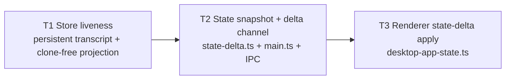

# Real-time streaming delivery — non-quadratic refactor · tasks.md

Date: 2026-08-16 · Scope: `vendor/pi-gui/apps/desktop` (vendored Electron app) + PBT suite
Goal doc: `requirements.md` (same directory) — read it first. This plan decomposes its
design direction (A: persistent transcript structure · B: state snapshot+delta · C: renderer apply)
into a 3-task serial DAG. Behavior preservation is the contract: transcript cache array
semantics, `DesktopAppState` shape, the IPC channels (`pi-gui:state-changed` etc.) and the
renderer's final state content stay byte-compatible; the two red K′ tests turn green while
K/J/unit and A–D / E–J stay green.

---

## Repo facts (verified 2026-08-16, against the real files)

- **PBT baseline** (`pnpm --filter @pi-gui/desktop test:pbt`): `# tests 105 / # pass 103 / # fail 2`.
  The only red tests are the K′ pair in `test/pbt/store-liveness.test.mts`:
  - `not ok 47 - K′: the full fold path must not rebuild the whole transcript array per event`
    (property, counterexample `[300]` after shrink)
  - `not ok 48 - K′ (deterministic): 3000 events must fold with linear rebuild work`
  - **The current red cause is a test-harness Proxy bug, not (only) the quadratic spread**:
    `proxyRebuildWork` (store-liveness.test.mts:185) intercepts `set` but lets `get` fall
    through `Reflect.get(target, prop, receiver)`, which returns the _unbound_
    `Map.prototype.get`; calling it with `this = proxy` throws
    `TypeError: Method Map.prototype.get called on incompatible receiver #<Map>`
    (observed at `app-store-timeline.js:160` → `applyTimelineEvent` → `driveEvent` →
    `measureRebuildWork`). Fix the harness (intercept `get` → `(k) => target.get(k)`,
    mirroring `proxyTranscriptCache` at :151) as part of T1's test work; only then does the
    assertion become measurable. Even with the proxy fixed, the current per-event
    `[...transcript]` rebuild violates the bound (Σ rebuilt-lengths at 3000 events ≈ 450 K ≫
    64×3000 = 192 K), so the pair stays red until the persistent structure lands.
- **Unrelated pre-existing flake** (do NOT chase it): `not ok 23 - json-file-store: write →
read roundtrip preserves arbitrary JSON payloads and keys` (persistence.test.mts:427) failed
  1 of 3 isolated runs (counterexample `["",[-0]]`, seed 1080680249 — a `-0` JSON roundtrip
  fast-check seed). Baseline run #1 was clean 103/2. Document, don't fix.
- **Store cache type today**: `SessionStateMap.transcriptCache = new Map<string, TranscriptMessage[]>()`
  (electron/session-state-map.ts:36). Value arrays are immutable-style (rebuilt on mutation, never
  mutated in place) — this invariant is load-bearing for the transcript delta diff
  (`computeTranscriptDelta` relies on unchanged items keeping object identity).
- **Per-event timeline mutations rebuild the whole array**: `[...transcript]` spreads at
  app-store-timeline.ts:74 (appendUserMessage), :88 (appendQueuedUserMessage), :118
  (appendAssistantDelta), :159 (appendThinkingDelta), :196 (finalizeActiveThinking), :234
  (applyTimelineEvent); plus `findIndex` scans (:89, :122, :163, :197, :351) and per-delta
  string concat `current.text + text` (:127, :166).
- **Session-state fold** (already K-fixed, must stay as-is): `applySessionEventState`
  (app-store-session-state.ts:6) consumes `transcriptCache.get(key)` read-only (line 23) for
  `previewFromTranscript` / `hasUnseenSessionUpdate` — index reads + iteration only, zero copy
  methods. `previewFromTranscript` (app-store-utils.ts:536) is a backward index scan;
  `latestSessionActivityAt` (:245) a forward iteration; both are served O(1)-per-item by a
  readonly-array-shaped object.
- **app-store.ts cache consumers**: `getSelectedTranscriptItemsForView` :268 (raw read :279),
  `buildSelectedTranscriptRecord` :2679 (`.map(cloneTranscriptMessage)` :2685),
  `resolveViewedAt` :2966 (read :2974), `syncSelectedSessionHydrationState` :3151
  (`.map(cloneTranscriptMessage)` :3158), `ensureTranscriptLoaded` :1489 (set :1497),
  `reloadTranscriptFromDriver` :1501 (set :1505), `buildWorkspaceRecords` call :1310.
  `projectStateForView` :287 contains `...structuredClone(state)` at :312 — the per-push
  deep clone (T1 removes it; `emit()`'s clone at :2730 and the IPC-handler clones are OUT of
  scope).
- **main.ts publish path**: `publishStateToWindow` :468 (project → `rememberWindowView` →
  `webContents.send(desktopIpc.stateChanged, projected)`), `publishSelectedTranscriptToWindow`
  :479, `attachStatePublisher` :789 (coalesced 80 ms schedulers via `createCoalescedPublisher`,
  `electron/stream-publish.ts`; renderer-recovery delete of `lastPublishedTranscriptByWebContentsId`
  at :796; per-window map declared :125). `STREAM_PUBLISH_INTERVAL_MS = 80` (stream-publish.ts:14).
- **Transcript delta pattern to mirror** (`src/transcript-delta.ts`, PBT-included):
  `decideTranscriptDelivery` / `computeTranscriptDelta` / `applyTranscriptDelta` + types
  `TranscriptDeltaOp` / `TranscriptDeltaPayload` / `PublishedTranscriptSnapshot` /
  `TranscriptDelivery`; reference-accelerated diff; empty delta ⇒ skip send.
- **Renderer**: `src/app/desktop-app-state.ts` `useDesktopAppState` — `applyState` (:19) →
  `applySnapshotIfNewer` (:91, revision guard), `onStateChanged` (:35), `onSelectedTranscriptChanged`
  (:40), `onTranscriptDelta` (:51). `App.tsx` consumes the hook's `[snapshot, setSnapshot,
selectedTranscript]` — keep this return shape.
- **IPC surface**: `desktopIpc.stateChanged` `pi-gui:state-changed` (ipc.ts:58),
  `selectedTranscriptChanged` :60, `transcriptDelta` :64; `PiDesktopApi.onTranscriptDelta` :289;
  preload.ts `onTranscriptDelta` :98 via `subscribeIpc`.
- **PBT compile scope**: `tsconfig.pbt.json` include list (electron/* pure modules +
  `src/desktop-state.ts`, `src/transcript-delta.ts`, `src/ipc.ts`, …); new pure modules MUST be
  added here (rule 7). Tests glob: `node --test "test/pbt/**/*.test.mts"`.
- **PBT harnesses that mirror the store wiring** (all three construct
  `Map<string, TranscriptMessage[]>` caches and must adapt to the new cache type):
  `test/pbt/store-liveness.test.mts`, `test/pbt/streaming-sync.test.mts`,
  `test/pbt/transcript-delta.test.mts`. Also `test/pbt/workspace-records.test.mts` and
  `test/pbt/integrated-flow.test.mts` call `buildWorkspaceRecords` with plain maps — kept
  compiling via the `ReadonlyMap<string, readonly TranscriptMessage[]>` parameter pin below.
- **`DesktopAppState`** (src/desktop-state.ts:299): 30 top-level slices incl.
  `orchestrationChildren: readonly OrchestrationChildThread[]` (:315, each child carries
  `transcript` + `evidence` — the dominant per-push payload) and `revision: number` (:328).
  `SelectedTranscriptRecord` :186.

---

## Task DAG (manifest)

Execution form: **serial** — a full chain; T2 consumes T1's store contract, T3 consumes T2's
channel contract. No same-level parallelism, so the shared tree never needs `build`-free
coordination beyond the per-task gates below. Order: `T1, T2, T3`



```yaml
- id: T1
  title: 'Store liveness: persistent transcript structure + clone-free projection'
  description: >-
    Replace the per-event full-array rebuilds in electron/app-store-timeline.ts with a chunked
    persistent list (TranscriptCacheEntry, TRANSCRIPT_CHUNK_SIZE=64, id index, active-message
    parts list) so the full fold path (timeline mutations + applySessionEventState) is linear;
    change the transcriptCache value type to Map<string, TranscriptCacheEntry> across
    session-state-map/app-store/app-store-session-state/app-store-utils and the three PBT
    harnesses; fix the K′ harness Proxy (intercept get); remove the per-push structuredClone
    in projectStateForView so projected slices keep object identity. Ship unit/PBT tests for the
    entry (append/replace/remove/id-index/toArray identity/parts finalize). K′ pair is this
    task's acceptance: it must turn green while K/J/unit and all other lanes stay green.
    Tags: FR-1, FR-2, AC-1.
  files:
    - electron/app-store-timeline.ts
    - electron/session-state-map.ts
    - electron/app-store-utils.ts
    - electron/app-store-session-state.ts
    - electron/app-store.ts
    - test/pbt/store-liveness.test.mts
    - test/pbt/streaming-sync.test.mts
    - test/pbt/transcript-delta.test.mts
    - test/pbt/transcript-store.test.mts
  deps: []
  level: 1
- id: T2
  title: 'State snapshot + delta channel (pure module + main-process publish + IPC)'
  description: >-
    New pure module src/state-delta.ts (PBT-compiled; added to tsconfig.pbt.json include)
    mirroring transcript-delta.ts: decideStateDelivery / computeStateDelta / applyStateDelta /
    stateSlicesWithoutOrchestration with the pinned signatures below; rewire main.ts
    publishStateToWindow to full-vs-delta per webContents with per-window last-published maps,
    ship orchestrationChildren on a new pi-gui:orchestration-changed channel (reference-changed
    only) so child-thread transcripts never ride the state push; add the two channels + two
    PiDesktopApi methods in src/ipc.ts and the two subscribeIpc wrappers in electron/preload.ts.
    Ship test/pbt/state-delta.test.mts locking convergence (final state byte-equal to the full
    snapshot path), identity of untouched slices, delivery decisions, orchestration exclusion
    and revision handling.
    Tags: FR-3, FR-4, AC-2.
  files:
    - src/state-delta.ts
    - test/pbt/state-delta.test.mts
    - tsconfig.pbt.json
    - src/ipc.ts
    - electron/preload.ts
    - electron/main.ts
  deps: [T1]
  level: 2
- id: T3
  title: 'Renderer state-delta application (identity-preserving apply)'
  description: >-
    Consume the state-delta and orchestration-changed channels in src/app/desktop-app-state.ts:
    apply ops locally with a revision guard, merge orchestrationChildren from a local ref into
    full pushes, keep untouched slices reference-identical so memo comparators short-circuit;
    keep the hook return shape [snapshot, setSnapshot, selectedTranscript] so App.tsx and
    callers are untouched; write the bounded live e2e spec
    tests/core/streaming-delivery-live.spec.ts (run by the orchestrator after build). The
    whole-refactor gate (full build, PBT x3 stable, e2e lane, benchmark, scope) is AC-4,
    executed by the orchestrator after this task.
    Tags: FR-5, FR-6, AC-3, AC-4.
  files:
    - src/app/desktop-app-state.ts
    - tests/core/streaming-delivery-live.spec.ts
  deps: [T2]
  level: 3
```

---

## FIXED API contract (pin — later tasks implement against this, never against earlier choices)

### A. Persistent transcript structure — exported surface (T1 ships; T2/T3 never touch it)

Pinned in `electron/app-store-timeline.ts`:

```ts
export const TRANSCRIPT_CHUNK_SIZE = 64; // must match the K′ per-event element-copy budget

export class TranscriptCacheEntry {
  // READ surface — the entry MUST be structurally assignable to `readonly TranscriptMessage[]`
  // (length: number + numeric index access + [Symbol.iterator]) so the array-semantics consumers
  // keep compiling UNCHANGED (previewFromTranscript, latestSessionActivityAt,
  // hasUnseenSessionUpdate, updateSessionRecord, buildWorkspaceRecords/buildSessionRecord).
  // The index accessor for the in-flight assistant/thinking message returns a synthesized item
  // carrying the CURRENT joined text (O(1) rope cache — no per-delta flat join, no stale text).
  get length(): number;
  [index: number]: TranscriptMessage;
  [Symbol.iterator](): IterableIterator<TranscriptMessage>;
  toArray(): readonly TranscriptMessage[]; // O(n) materialization — publish/persist rate ONLY, never per event
  static fromArray(items: readonly TranscriptMessage[]): TranscriptCacheEntry;
  static empty(): TranscriptCacheEntry;
  // MUTATION surface (called by the timeline functions in this file only; the exact internal
  // method names may be adjusted by the worker, the exported type + cache type + toArray +
  // structural compatibility above are FIXED):
  //   append(item) O(1) · replaceById(id, next) O(chunk) · removeById(id) O(chunk)
  //   findById(id) O(1) via a maintained id→chunk index
  //   streaming parts: begin/append/finalize for the active assistant message AND thinking block
  //   (parts: string[] appended per delta; the item object is materialized with the joined text
  //   only at finalize — content-changed replacement per delta is NOT used for the active item).
}
```

Hard rules for T1:

1. **No per-event `transcriptCache.set`**: mutations mutate the entry in place (the K′ proxy
   counts `set`-call lengths; Σ must stay ≈ 0). `set` happens only on entry creation and on
   driver reloads (`ensureTranscriptLoaded`/`reloadTranscriptFromDriver` wrap with
   `TranscriptCacheEntry.fromArray`). Per-event element-copy budget ≤ TRANSCRIPT_CHUNK_SIZE
   (mid-list chunk rebuilds).
2. **No per-event O(n) id scans**: `findIndex`-by-id becomes the entry's O(1) index
   (appendQueuedUserMessage by message.id, appendAssistantDelta by active id, upsertToolRow by
   callId, finalizeActiveThinking by thinking id, removeWorkingActivity by activity id).
3. **J contract**: content-unchanged items keep object identity across folds (finalized items
   are frozen in immutable chunks; only the containing chunk of a changed/replaced item is
   rebuilt). The synthesized active-item view is exempt (content changes every delta).
4. **Cache type change** (compiler-guided ripple, all `// Cardo:` marked):
   - `session-state-map.ts:36` → `readonly transcriptCache = new Map<string, TranscriptCacheEntry>();`
   - `app-store-session-state.ts` `applySessionEventState` param →
     `transcriptCache: ReadonlyMap<string, TranscriptCacheEntry>`; body keeps `get(key) ?? []`
     (the entry is array-compatible; preview path unchanged).
   - `app-store-utils.ts` `buildWorkspaceRecords` (:21) and `buildSessionRecord` (:203) param →
     `transcriptCache: ReadonlyMap<string, readonly TranscriptMessage[]>` — accepts BOTH the
     entry map (app-store.ts:1310) and the plain maps the PBT tests construct (zero test churn
     in workspace-records/integrated-flow).
   - `app-store.ts`: :279 `getSelectedTranscriptItemsForView` returns `entry.toArray()` (the
     delta diff then compares materialized arrays — unchanged items still share identity);
     :2685 and :3158 `(…).toArray().map(cloneTranscriptMessage)` (O(n) at publish/hydration
     rate); :1497/:1505 wrap with `TranscriptCacheEntry.fromArray`.
   - **Fallback if the structural assignability of `TranscriptCacheEntry` →
     `readonly TranscriptMessage[]` does not typecheck** (documented decision, do not silently
     deviate): type the affected app-store-utils params as
     `TranscriptCacheEntry | readonly TranscriptMessage[]` and note it in the PR.
5. **K stays meaningful**: adapt the K harness proxy so it wraps the entry returned by `.get()`
   and counts copy-method access AND `toArray()` calls; K asserts both are zero in the
   session-state fold (the fold must consume the entry read-only, never materialize).
6. **K′ harness fix** (test-only): `proxyRebuildWork` must intercept `get`:
   `if (prop === "get") return (k: string) => target.get(k);` (the current fall-through throws
   the `incompatible receiver` TypeError — see Repo facts).
7. **Revert-verify**: stash the timeline refactor (keep the harness fix) → K′ pair must go red
   (Σ per-event sets ≫ bound); restore → green. Same for the structuredClone removal: re-adding
   the clone must make the state-delta PBT (T2) fail convergence, proving it is locked.

### B. State snapshot + delta — pinned module contract (T2 ships; T3 consumes)

New pure module `src/state-delta.ts` (added to `tsconfig.pbt.json` include), mirroring
`src/transcript-delta.ts` shapes:

```ts
import type { DesktopAppState } from './desktop-state';

export type StateDeltaSliceKey = Exclude<keyof DesktopAppState, 'orchestrationChildren'>;
export type StateSlices = Pick<DesktopAppState, StateDeltaSliceKey>;

export interface StateDeltaOp {
  readonly kind: 'set';
  readonly key: StateDeltaSliceKey;
  readonly value: DesktopAppState[StateDeltaSliceKey]; // undefined ⇒ the key is DELETED on apply (absent ≠ undefined)
}

export interface StateDeltaPayload {
  readonly revision: number; // the store revision the ops advance the renderer TO (stale/dup guard)
  readonly ops: readonly StateDeltaOp[];
}

export interface PublishedStateSnapshot {
  readonly revision: number; // revision of the last delivered state
  readonly slices: StateSlices; // reference-stable — NEVER deep-copied (the clone removal in T1 makes this sound)
}

export type StateDelivery =
  { readonly kind: 'full' } | { readonly kind: 'delta'; readonly ops: readonly StateDeltaOp[] };

/** Full on: current === null · never published (last undefined) · renderer recovery · session switch
 *  (selectedWorkspaceId/selectedSessionId differ from last). Delta otherwise (empty ops ⇒ skip send). */
export function decideStateDelivery(
  last: PublishedStateSnapshot | undefined,
  current: StateSlices | null,
): StateDelivery;

/** Reference-accelerated: only slices whose reference changed produce ops (revision included — it
 *  changes on every push; orchestrationChildren NEVER appears). */
export function computeStateDelta(
  previous: StateSlices,
  current: StateSlices,
): readonly StateDeltaOp[];

/** Renderer-side apply; untouched slices keep object identity (memo short-circuit). */
export function applyStateDelta(
  current: DesktopAppState,
  ops: readonly StateDeltaOp[],
): DesktopAppState;

/** Drop the orchestrationChildren slice (destructure-drop, key ABSENT — never undefined). */
export function stateSlicesWithoutOrchestration(state: DesktopAppState): StateSlices;
```

Pinned IPC additions (`src/ipc.ts` + `electron/preload.ts`):

```ts
desktopIpc.stateDelta: "pi-gui:state-delta";                 // NEW
desktopIpc.orchestrationChanged: "pi-gui:orchestration-changed"; // NEW
// PiDesktopApi (ipc.ts):
onStateDelta(listener: (payload: StateDeltaPayload) => void): () => void;
onOrchestrationChanged(listener: (payload: { readonly orchestrationChildren: readonly OrchestrationChildThread[] }) => void): () => void;
// preload.ts: two `subscribeIpc(desktopIpc.<channel>, listener)` wrappers mirroring onTranscriptDelta (:98).
```

Pinned main-process wiring (`electron/main.ts`, all `// Cardo:` marked):

- Two per-webContents maps beside :125: `lastPublishedStateByWebContentsId:
Map<number, PublishedStateSnapshot>` and
  `lastPublishedOrchestrationByWebContentsId: Map<number, readonly OrchestrationChildThread[]>`.
- `publishStateToWindow` (:468): project (unchanged) → `slices =
stateSlicesWithoutOrchestration(projected)` → `decideStateDelivery(last, slices)` →
  full: `send(desktopIpc.stateChanged, slices)`; delta non-empty:
  `send(desktopIpc.stateDelta, { revision: projected.revision, ops })`; empty: no send — then
  ALWAYS update `lastPublishedStateByWebContentsId` (next delta diffs against the latest).
  Finally: if `projected.orchestrationChildren !== lastOrchestration` →
  `send(desktopIpc.orchestrationChanged, { orchestrationChildren })` + update.
- `attachStatePublisher` `startPublishing` (:791): delete BOTH new maps alongside the
  transcript-map delete (:796) so a reloaded renderer starts from full + orchestration resend.
- No transport/coalescing changes; `store.emit()` (:2730 clone) and IPC-handler clones are OUT
  of scope. `stateSlicesWithoutOrchestration` keeps the per-window `composerDraft`/`lastError`
  projection fields — the diff is per-window against each window's own last-published slices.

---

## File-ownership map (disjoint; validator-enforced)

| Task         | Owns (CREATE/EDIT)                                                                                                                                                                                                                                                                                                                                                                 |
| ------------ | ---------------------------------------------------------------------------------------------------------------------------------------------------------------------------------------------------------------------------------------------------------------------------------------------------------------------------------------------------------------------------------- |
| T1           | `electron/app-store-timeline.ts` · `electron/session-state-map.ts` · `electron/app-store-utils.ts` · `electron/app-store-session-state.ts` · `electron/app-store.ts` (sites :279/:312/:1497/:1505/:2685/:2974/:3158) · `test/pbt/store-liveness.test.mts` · `test/pbt/streaming-sync.test.mts` · `test/pbt/transcript-delta.test.mts` · `test/pbt/transcript-store.test.mts` (NEW) |
| T2           | `src/state-delta.ts` (NEW) · `test/pbt/state-delta.test.mts` (NEW) · `tsconfig.pbt.json` · `src/ipc.ts` · `electron/preload.ts` · `electron/main.ts`                                                                                                                                                                                                                               |
| T3           | `src/app/desktop-app-state.ts` · `tests/core/streaming-delivery-live.spec.ts` (NEW)                                                                                                                                                                                                                                                                                                |
| Orchestrator | `pnpm --filter @pi-gui/desktop build` (shared `out/`) · full e2e lane · benchmark · final gate (AC-4) · skill/docs note (optional): update `streaming-ui-delivery` skill `references/cardo-store-liveness.md` residual paragraph + cardo-codebase SKILL.md residual bullet ("persistent transcript structure would remove them" — now landed)                                      |

READ-only for all: `src/desktop-state.ts`, `src/transcript-delta.ts`, `electron/stream-publish.ts`,
`requirements.md`, the K′/A–D/E–J PBT files (when not owned), `tests/helpers/electron-app.ts`,
the two e2e specs `tests/core/transcript-staleness.spec.ts` + `tests/live/extensions-dialogs.spec.ts`.

---

## T1 — Store liveness: persistent transcript structure + clone-free projection (Level 1)

**Goal** (FR-1, FR-2): the full fold path (timeline mutations + session-state fold) becomes
linear; the publish input stops deep-cloning per push. The K′ pair is THIS task's acceptance.

**FIXED API contract**: section A above (exported entry surface + hard rules 1–7).

**Key edit map** (all `// Cardo:` marked; every vendored change marked):

- `app-store-timeline.ts`: introduce `TranscriptCacheEntry` + `TRANSCRIPT_CHUNK_SIZE`; rewrite
  the 8 exported functions to entry operations; remove all six `[...transcript]` spreads and the
  `findIndex` scans; keep every function's signature except the cache value type
  (`Map<string, TranscriptCacheEntry>`); `timelineFromDriverTranscript` unchanged (still returns
  `TranscriptMessage[]`, wrapped by callers at set time).
- `app-store.ts` :312 remove `structuredClone(state)` → `{ ...state, … }` (projected slices keep
  identity — the prerequisite for reference-accelerated state deltas in T2; the spread itself is
  unchanged); :279/:2685/:3158 `toArray()`-based reads; :1497/:1505 wrap with `fromArray`.
- `app-store-session-state.ts` / `app-store-utils.ts` / `session-state-map.ts`: type pins from
  section A (bodies otherwise untouched).
- Test work (tests travel with implementation):
  - `store-liveness.test.mts`: fix `proxyRebuildWork.get`; adapt the harness cache type; extend
    the K proxy to also count `toArray()` on the entry; adapt `measureFoldCopyPasses` /
    `measureRebuildWork` / the J-test reads to `entry.toArray()`.
  - `streaming-sync.test.mts` + `transcript-delta.test.mts`: adapt `FlowCaches`/`freshCaches` and
    cache reads to the entry type (compiler-guided; content assertions switch to `toArray()`).
  - `test/pbt/transcript-store.test.mts` (NEW): entry unit + PBT — append/replaceById/removeById
    semantics, O(1) findById, chunk rolling at TRANSCRIPT_CHUNK_SIZE, toArray() content order,
    J-style identity of untouched items across mutations, active-message parts finalize
    (joined text correct; preview text current while streaming), remove of the "Working…" row,
    and a K′-style budget assertion (Σ set-call lengths ≤ 64×events over the real fold).
- No build. No commit. All changes in owned files only.

**Verification (repo root, exact)**:

1. `pnpm --filter @pi-gui/desktop test:pbt` — EXPECT: all 105 baseline tests green (K′ pair
   included) PLUS the new transcript-store tests green; `# fail 0`. Run twice more — the
   unrelated json-file-store flake (see Repo facts) may appear; re-run to confirm, do not fix.
2. `pnpm --filter @pi-gui/desktop typecheck`
3. Grep gates:
   - `search_files pattern "structuredClone" path electron/app-store.ts` → line 312 absent
     (remaining hits are the out-of-scope sites :233/:2730 + IPC handlers — list them in the PR).
   - `search_files pattern "\.\.\.transcript" path electron/app-store-timeline.ts` → 0 hits.
   - `search_files pattern "findIndex" path electron/app-store-timeline.ts` → 0 hits.
4. Revert-verify (rule 7 / skill discipline): stash the timeline refactor only → K′ pair red;
   restore → green.

**Per-task acceptance (AC-1)**:

- K′ property + K′ deterministic green; K / K (deterministic) / unit / J green; all other lanes
  green (A–D in streaming-sync, E–J in transcript-delta, persistence, workspace-records,
  state-transitions, integrated-flow).
- Benchmark gate (shared acceptance command in acceptance.md §3): 3000 events < 4 µs/event and
  per-event cost no longer grows with transcript length.
- Grep gates above pass; `// Cardo:` markers on every vendored edit.

---

## T2 — State snapshot + delta channel (Level 2, deps: T1)

**Goal** (FR-3, FR-4): main-process publish becomes full-once + deltas; orchestrationChildren
(complete child-thread transcripts + evidence) leaves the per-push state payload.

**FIXED API contract**: section B above — implement `src/state-delta.ts` exactly to the pinned
signatures (do not rename); wire the two channels; T3 consumes this contract.

**Key edit map** (all `// Cardo:` marked):

- `src/state-delta.ts` (NEW): pure module per section B — no React, no Electron imports
  (PBT-compiled; imports only `./desktop-state` types). `stateSlicesWithoutOrchestration`
  destructure-drops the key.
- `tsconfig.pbt.json`: add `"src/state-delta.ts"` to `include`.
- `electron/main.ts`: per-window maps; `publishStateToWindow` rewrite per section B; the two
  recovery deletes in `attachStatePublisher`; `import { decideStateDelivery, … }` from
  `../src/state-delta` (mirror the existing transcript-delta import at :91).
- `src/ipc.ts`: two channel constants + two `PiDesktopApi` methods (types import
  `StateDeltaPayload` from `./state-delta`).
- `electron/preload.ts`: two `subscribeIpc` wrappers.
- `test/pbt/state-delta.test.mts` (NEW; tests travel with implementation) — invariants:
  - **CONV (convergence / byte-compat)**: for arbitrary `previous` state and arbitrary slice
    mutations producing `next`: `JSON.stringify(applyStateDelta(previous,
computeStateDelta(previous, next))) === JSON.stringify(next)` (the renderer's final content
    is byte-identical to the full-snapshot result).
  - **ID (identity)**: slices not in the ops keep `===` identity across `applyStateDelta`.
  - **DEC (delivery decision)**: `last === undefined` → full; session switch → full;
    content-unchanged slices → delta with zero ops; same-session change → delta with
    `ops.length ≤ changed-slice count` (liveness).
  - **ORCH (exclusion)**: `computeStateDelta` never emits an `orchestrationChildren` op;
    `stateSlicesWithoutOrchestration` drops the key entirely (`"orchestrationChildren" in slices`
    is false).
  - **REV**: applying a delta sets `revision` to the payload revision; ops with `value ===
undefined` delete the key (absent, not `undefined`).

**Verification (repo root, exact)**:

1. `pnpm --filter @pi-gui/desktop test:pbt` — EXPECT: all tests green (T1's + state-delta's),
   `# fail 0`.
2. `pnpm --filter @pi-gui/desktop typecheck`
3. Grep gates:
   - `search_files pattern "pi-gui:state-delta|pi-gui:orchestration-changed" path src/ipc.ts` → 2 hits.
   - `search_files pattern "lastPublishedStateByWebContentsId" path electron/main.ts` → ≥ 4 hits
     (declaration, full branch, delta branch, recovery delete).
   - `search_files pattern "src/state-delta.ts" path tsconfig.pbt.json` → 1 hit.
4. Revert-verify: re-introduce `structuredClone` in `projectStateForView` → state-delta CONV must
   fail (proves T1's clone removal is locked by this test).

**Per-task acceptance (AC-2)**: all of the above; no existing channel renamed or repurposed;
`pi-gui:state-changed` still delivers the full (orchestration-stripped) state on session switch /
first publish / recovery.

---

## T3 — Renderer state-delta application (Level 3, deps: T2)

**Goal** (FR-5, FR-6): the renderer applies state ops locally with a revision guard; untouched
slices keep object identity (memo short-circuit); `orchestrationChildren` is merged from its own
channel; the final state content is byte-compatible with today.

**Key edit map** (all `// Cardo:` marked) — `src/app/desktop-app-state.ts` is the ONLY code file:

- Subscribe `api.onStateDelta(payload)`: drop when `payload.revision <= current.revision`
  (mirrors `applySnapshotIfNewer`'s guard); otherwise
  `setSnapshot((cur) => (cur ? applyStateDelta(cur, payload.ops) : cur))`.
- `applyState` (:19) accepts `StateSlices | DesktopAppState`: when the incoming object lacks
  `orchestrationChildren` (pushed full state), merge from the local ref; when present (IPC
  responses via `updateSnapshot`), also sync the local ref. Revision guard unchanged.
- Subscribe `api.onOrchestrationChanged(payload)`: update the local ref and re-merge
  `{ ...cur, orchestrationChildren: payload.orchestrationChildren }` (one-slice spread — all
  other slices keep identity).
- Keep the hook return `[snapshot, setSnapshot, selectedTranscript]` and
  `updateSnapshot`/`applySnapshotIfNewer` exports — App.tsx/sidebar/composer stay untouched
  (verify by typecheck; no edits to those files).
- `tests/core/streaming-delivery-live.spec.ts` (NEW — written here, RUN by the orchestrator
  after `build`): the bounded live recipe from acceptance.md §4 (launch → create thread →
  getState revision>0 → submit message → poll revision bump + sidebar preview text → toggle
  sidebar → assert responsive + state applied → close). Pattern: `tests/helpers/electron-app.ts`
  (`launchDesktop`/`makeUserDataDir`/`makeWorkspace`/`createNamedThread`/`getDesktopState`) +
  `tests/core/transcript-staleness.spec.ts` and `tests/live/extensions-dialogs.spec.ts` styles.

**Verification (repo root, exact)**:

1. `pnpm --filter @pi-gui/desktop typecheck`
2. `pnpm run lint` (root; strictTypeChecked, max-warnings 0)
3. `pnpm --filter @pi-gui/desktop test:pbt` — all green, `# fail 0` (T3 adds no pure modules;
   count unchanged from T2's).
4. NO `pnpm --filter @pi-gui/desktop build` (shared `out/` — orchestrator owns the build).

**Per-task acceptance (AC-3)**: all of the above; `git status` shows only the two owned files
plus T1/T2's owned files.

**Whole-refactor gate (AC-4 — orchestrator, after T3)**: see acceptance.md — full build, PBT ×3
consecutive stable runs, typecheck + lint, e2e lane (transcript-staleness + extensions-dialogs +
streaming-delivery-live), benchmark gate, byte-compat evidence, scope guard.

---

## Traceability

| Requirement (requirements.md)                                                               | Tag  | Owner        | Locked by                                         |
| ------------------------------------------------------------------------------------------- | ---- | ------------ | ------------------------------------------------- |
| K′ linear fold (persistent transcript structure, parts list, J identity, array semantics)   | FR-1 | T1           | store-liveness K′ pair + transcript-store PBT + J |
| Remove `structuredClone(state)` from `projectStateForView`                                  | FR-2 | T1           | grep gate + state-delta CONV (T2 revert-verify)   |
| State snapshot+delta channel (`decideStateDelivery`/`computeStateDelta`/`applyStateDelta`)  | FR-3 | T2           | state-delta PBT (CONV/ID/DEC/REV)                 |
| orchestrationChildren excluded from per-push state (own channel)                            | FR-4 | T2           | state-delta ORCH invariant + main.ts wiring       |
| Renderer identity-preserving apply (memo short-circuit)                                     | FR-5 | T3           | state-delta ID + live spec                        |
| Behavior preservation: IPC protocol, `DesktopAppState` shape, byte-compatible final content | FR-6 | T3 (+all)    | CONV + existing e2e specs + full PBT              |
| T1 acceptance (K′ green, K/J/unit stay green, benchmark, grep gates)                        | AC-1 | T1           | T1 verification                                   |
| T2 acceptance (state-delta PBT green, typecheck, grep gates, revert-verify)                 | AC-2 | T2           | T2 verification                                   |
| T3 acceptance (typecheck, lint, full PBT green, live spec written)                          | AC-3 | T3           | T3 verification                                   |
| Whole refactor gate (build, PBT ×3 stable, e2e lane, benchmark, scope)                      | AC-4 | Orchestrator | acceptance.md                                     |

---

## Cross-cutting notes

- **Vendored changes**: every edit inside `vendor/pi-gui/apps/desktop` carries a
  `// Cardo: …` marker (TS) / `/* Cardo: … */` (CSS) — including the PBT test files and the new
  modules' headers.
- **New pure modules** (`src/state-delta.ts`; the entry lives in the already-included
  `app-store-timeline.ts`): `src/state-delta.ts` must be added to `tsconfig.pbt.json` include
  (rule 7) so the PBT compiles the exact production code.
- **Never run `pnpm --filter @pi-gui/desktop build` from a task** (shared `out/`); the
  orchestrator builds once. Each task's verification is typecheck + its own PBT lane + grep
  gates. e2e specs are written (T3) but only RUN after the orchestrator's build.
- **Parallel workers**: this plan is serial by construction (full chain) — no same-level
  parallelism, so file-ownership disjointness holds globally (validator-enforced).
- **K′ harness discovery**: the red tests currently fail on the harness Proxy `get` TypeError
  (see Repo facts) — fix the harness in T1's test work BEFORE judging the assertion; then
  revert-verify the timeline refactor against the fixed harness.
- **Flake**: `json-file-store` roundtrip (persistence.test.mts:427) is a pre-existing fast-check
  seed flake (1/3 runs, `-0` counterexample) — unrelated to this refactor; do not "fix" it.
