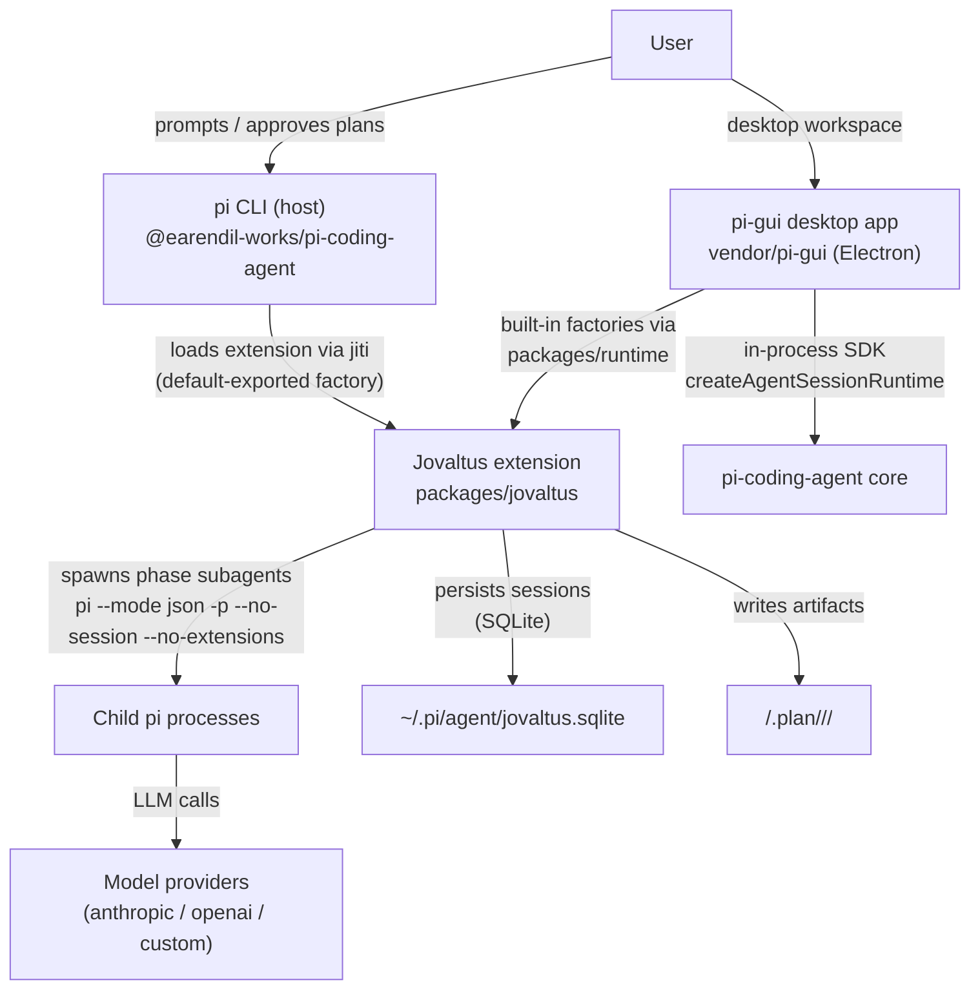

# Architecture

## System Context (C4 L1)



## Container Diagram (C4 L2)

```mermaid
graph TD
  subgraph Jovaltus extension
    Index["index.ts<br/>entry factory"]
    State["state.ts<br/>pipeline state machine"]
    Chain["chain.ts<br/>CHAIN tables + verdict readers"]
    Dispatch["dispatch.ts<br/>child process runner"]
    Prompts["prompts.ts<br/>prompt loader + token renderer"]
    PromptFiles["prompts/*.md<br/>7 phase goal docs"]
  end
  subgraph Desktop app (vendor/pi-gui)
    Main["Electron main<br/>main.ts + app-store.ts"]
    Driver["@pi-gui/pi-sdk-driver<br/>adapter over pi SDK"]
    Renderer["React renderer<br/>timeline / composer / settings"]
    Runtime["@cardo/runtime<br/>built-in extension registry"]
  end
  Pi["pi CLI host"]
  Index -->|"pi.registerTool ×4<br/>plan/execute/simplify/review"| Pi
  Index -->|"pi.on('before_agent_start')<br/>pi.on('agent_settled')"| Pi
  Main -->|"extensionFactories spread<br/>@cardo/runtime"| Driver
  Runtime -->|"imports jovaltus factory"| Index
  Driver -->|"createAgentSessionRuntime<br/>ModelRuntime (pi 0.84.1)"| PiCore["pi-coding-agent SDK"]
  Index --> State
  Index --> Chain
  Index --> Dispatch
  Dispatch -->|"renders prompt<br/>via [[token]] substitution"| Prompts
  Prompts --> PromptFiles
  Chain -->|"reads verdict.json"| PlanDir
  State -->|"read/write"| StateFile
  Dispatch -->|"spawn child (PI_CLI_PATH<br/>+ ELECTRON_RUN_AS_NODE in app)"| ChildPi["child pi processes"]
```

## Data Flow — one tool invocation

1. User calls a tool (`plan` / `execute` / `simplify` / `review`) in the pi session (CLI) or via the desktop app's agent.
2. `index.ts` handler validates args, computes the run directory (`<cwd>/.plan/<date>/<slug>/`), and calls `startPipeline` (`state.ts`) — persisted as a session row in `~/.pi/agent/jovaltus.sqlite`.
3. For each phase in the chain (`chain.ts` CHAIN table), `dispatchPhase` renders the phase prompt (`prompts.ts` → `prompts/<phase>.md` with `[[token]]` substitution) and spawns an isolated child `pi --mode json -p --no-session --no-extensions` process (`dispatch.ts`).
4. In the desktop app the child is launched through `PI_CLI_PATH` (resolved to the bundled `pi-coding-agent/dist/cli.js`) under `ELECTRON_RUN_AS_NODE`; in the CLI it uses the running pi binary.
5. The child runs with coding built-ins only (`read,bash,edit,write,grep,find,ls`), inheriting the parent's model/thinking level; its stdout JSONL is parsed for the final assistant text.
6. On child success the phase advances; `plan` runs prd→research→acceptance→tasks synchronously inside one tool call; `simplify`/`review` read the child-written `verdict.json`:
   - `pass` → finish pipeline, `done`.
   - `fix` → park in `*_waiting`, surface findings to the main agent.
7. `agent_settled` fires after the main agent's fixing turn: re-dispatches the reviewer; on another `fix` it wakes the main agent with `pi.sendUserMessage(findings)`. Loop continues until `pass` (no cap).

## Desktop app integration (cardo → pi-gui)

- pi-gui is vendored via `git subtree` under `vendor/pi-gui` (MIT, upstream tag `v0.1.0-beta.33`); cardo's `pnpm-workspace.yaml` includes `vendor/pi-gui/apps/*` and `vendor/pi-gui/packages/*`.
- `packages/runtime` (`@cardo/runtime`) exports `builtinExtensionFactories` (jovaltus factory) + `builtinExtensionMetadata` (display names); `vendor/pi-gui/apps/desktop/electron/main.ts` spreads both into the driver's `extensionFactories` / `inlineExtensionMetadata` seams.
- `@cardo/*` exports point at built `dist` (Node 22 `require(ESM)`); pi-coding-agent stays external (its exports are ESM-only — do not bundle it into the CJS main bundle).
- The vendored `@pi-gui/pi-sdk-driver` was ported from pi 0.80.6 to 0.84.1: `AuthStorage`/`ModelRegistry` replaced by `ModelRuntime`, constructors async, login via `AuthInteraction`.

## Key Architectural Decisions

| Decision                                                                                   | Rationale                                                                                                                                                                               | Status |
| ------------------------------------------------------------------------------------------ | --------------------------------------------------------------------------------------------------------------------------------------------------------------------------------------- | ------ |
| Child pi process per phase (not in-process SDK session)                                    | Official subagent example pattern; isolates context windows; `--no-extensions` prevents recursive extension load                                                                        | Active |
| Default-exported entry factory                                                             | pi loader contract: `jiti.import(path, { default: true })` then `typeof factory === "function"` — the single exception to the repo's named-exports rule                                 | Active |
| Sessions persisted to `~/.pi/agent/jovaltus.sqlite` (one row per run)                      | Cross-session resume; every run is listed (`list_sessions`) and resumable (`resume_session`); crashes sweep to `interrupted` (pid ownership)                                            | Active |
| No delegation tool in children                                                             | pi children have no `delegate_task`; execute phase completes the DAG itself instead of dispatching workers `[INFERRED — ported behavior, see packages/jovaltus/src/prompts/execute.md]` | Active |
| `agent_settled` + `pi.sendUserMessage()` replace Hermes `post_llm_call` + completion queue | pi's event model: settled fires after the agent's run ends; sendUserMessage wakes a new turn                                                                                            | Active |
| Vendor pi-gui via git subtree, not copy/fork                                               | Code lives in-repo while `git subtree pull` keeps upstream merges semi-automated; MIT with attribution                                                                                  | Active |
| Built-in extensions via `extensionFactories` seam                                          | `@cardo/runtime` supplies factories + metadata; app packages extensions inside the installer instead of external install                                                                | Active |
| Port vendored driver to pi 0.84.1 instead of downgrading cardo                             | Cardo standard is 0.84.1; one pi version everywhere (dual versions would split typebox/ExtensionAPI)                                                                                    | Active |
| `@cardo/*` exports point to dist; pi-coding-agent stays external                           | Node cannot load TS source as externalized dep; pi 0.84.1 exports are ESM-only so bundling it into the CJS main bundle is avoided                                                       | Active |
| Child dispatch via `PI_CLI_PATH` + `ELECTRON_RUN_AS_NODE` in the app                       | Electron main's `process.execPath` is the app binary, not node; bundled `cli.js` + node mode keeps the child-process isolation model                                                    | Active |

## Deployment Topology

No server component. The extension is loaded by pi at runtime via auto-discovery (`~/.pi/agent/extensions/`, `.pi/extensions/`, or `pi install`) or by the desktop app as a built-in. The desktop app is packaged with electron-builder (macOS target in the vendored config; signing/notarization required for distribution — see `setup.md`). There is no Docker, CI, or server component.

## How to Update

- New phase/tool or changed data flow → update diagrams + Data Flow section.
- New architectural decision → add row to the decisions table; mark inference with `[INFERRED]`.
