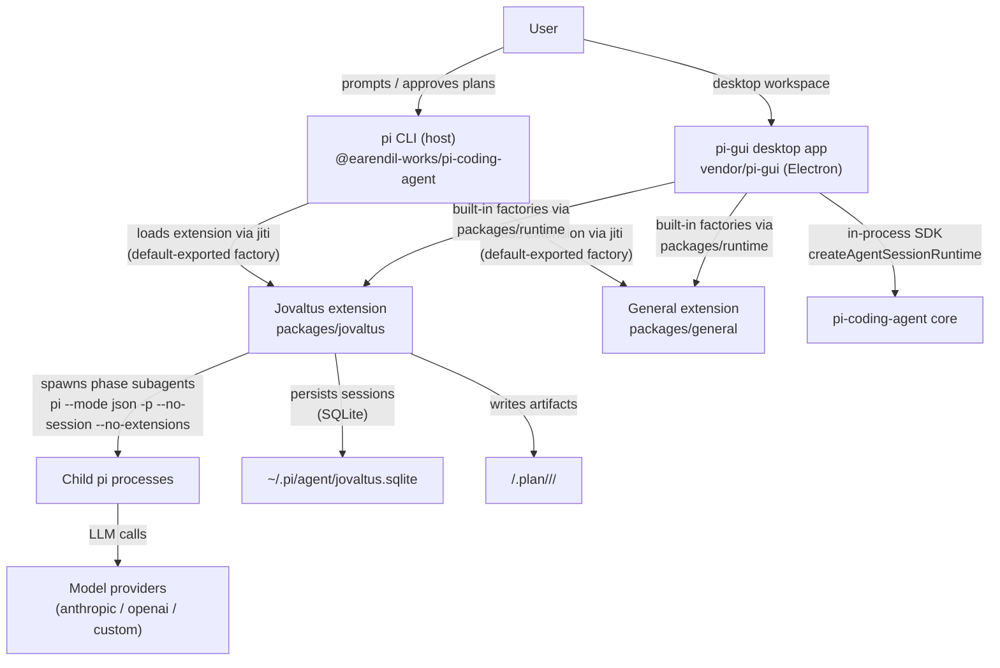

# Architecture

## System Context (C4 L1)



## Container Diagram (C4 L2)

```mermaid
graph TD
  subgraph Jovaltus extension
    Index["index.ts<br/>entry factory"]
    State["state.ts<br/>pipeline state machine"]
    Chain["chain.ts<br/>CHAIN tables + verdict readers"]
    Dispatch["dispatch.ts<br/>child process runner"]
    Prompts["prompts.ts<br/>prompt loader + token renderer"]
    PromptFiles["prompts/*.md<br/>5 phase goal docs"]
    PlanModel["plan.ts / plan-json.ts / plan-mermaid.ts / plan-progress.ts<br/>execution-plan model + artifacts"]
    Mode["plan-mode.ts<br/>tool gating + /planmode + shift+p"]
  end
  subgraph Desktop app (vendor/pi-gui)
    Main["Electron main<br/>main.ts + app-store.ts"]
    Driver["@pi-gui/pi-sdk-driver<br/>adapter over pi SDK"]
    Renderer["React renderer<br/>timeline / composer / settings"]
    Runtime["@cardo/runtime<br/>built-in extension registry"]
  end
  Pi["pi CLI host"]
  Index -->|"pi.registerTool ×6<br/>plan/execute_plan/simplify/review/list_sessions/resume_session"| Pi
  Index -->|"pi.on('before_agent_start')<br/>pi.on('agent_settled')<br/>pi.on('session_start')"| Pi
  Mode -->|"pi.setActiveTools / setStatus / setWidget<br/>registerCommand/Shortcut/Flag"| Pi
  Index --> Mode
  Index --> PlanModel
  PlanModel -->|"reads execution-plan.json"| PlanDir
  Main -->|"extensionFactories spread<br/>@cardo/runtime"| Driver
  Runtime -->|"imports jovaltus factory"| Index
  Driver -->|"createAgentSessionRuntime<br/>ModelRuntime (pi 0.84.1)"| PiCore["pi-coding-agent SDK"]
  Index --> State
  Index --> Chain
  Index --> Dispatch
  Dispatch -->|"renders prompt<br/>via [[token]] substitution"| Prompts
  Prompts --> PromptFiles
  Chain -->|"reads verdict.json"| PlanDir
  State -->|"read/write"| StateFile
  Dispatch -->|"spawn child (PI_CLI_PATH<br/>+ ELECTRON_RUN_AS_NODE in app)"| ChildPi["child pi processes"]
```

## Data Flow — one tool invocation

1. User calls a tool (`plan` / `execute_plan` / `simplify` / `review` — plus `list_sessions` / `resume_session`) in the pi session (CLI) or via the desktop app's agent. `plan` and `execute_plan` are only active in plan mode.
2. `index.ts` handler validates args, computes the run directory (`<cwd>/.plan/<date>/<slug>/`), and calls `startPipeline` (`state.ts`) — persisted as a session row in `~/.pi/agent/jovaltus.sqlite`.
3. For each phase in the chain (`chain.ts` CHAIN table), `dispatchPhase` renders the phase prompt (`prompts.ts` → `prompts/<phase>.md` with `[[token]]` substitution) and spawns an isolated child `pi --mode json -p --no-session --no-extensions` process (`dispatch.ts`).
4. In the desktop app the child is launched through `PI_CLI_PATH` (resolved to the bundled `pi-coding-agent/dist/cli.js`) under `ELECTRON_RUN_AS_NODE`; in the CLI it uses the running pi binary.
5. The child runs with coding built-ins only (`read,bash,edit,write,grep,find,ls`), inheriting the parent's model/thinking level; its stdout JSONL is parsed for the final assistant text.
6. `plan` runs prd → design inside the tool call (asking the user to clarify requirements first when the host has a UI), then parks in `plan_waiting` with a handoff instructing the main agent to write failing PBTs + `execution-plan.json`. `agent_settled` validates the JSON: valid → `done`, missing/invalid → `failed` (the run can be resumed after the artifact is written). `execute_plan` resolves a done plan session, parses its `execution-plan.json`, and dispatches the plan's subagents (batches serial, agents within a batch parallel) — leaving changes uncommitted.
7. `simplify`/`review` read the child-written `verdict.json`: `pass` → finish pipeline, `done`; `fix` → park in `*_waiting`, surface findings to the main agent. `agent_settled` re-dispatches the reviewer after the fixing turn; on another `fix` it wakes the main agent with `pi.sendUserMessage(findings)`. Loop continues until `pass` (no cap).

## Desktop app integration (cardo → pi-gui)

- pi-gui is vendored via `git subtree` under `vendor/pi-gui` (MIT, upstream tag `v0.1.0-beta.33`); cardo's `pnpm-workspace.yaml` includes `vendor/pi-gui/apps/*` and `vendor/pi-gui/packages/*`.
- `packages/runtime` (`@cardo/runtime`) exports `builtinExtensionFactories` (general + jovaltus factories) + `builtinExtensionMetadata` (display names); `vendor/pi-gui/apps/desktop/electron/main.ts` spreads both into the driver's `extensionFactories` / `inlineExtensionMetadata` seams. `General` runs first in the chain, so its working rules precede Jovaltus's pipeline status in the assembled system prompt.
- `@cardo/*` exports point at built `dist` (Node 22 `require(ESM)`); pi-coding-agent stays external (its exports are ESM-only — do not bundle it into the CJS main bundle).
- The vendored `@pi-gui/pi-sdk-driver` was ported from pi 0.80.6 to 0.84.1: `AuthStorage`/`ModelRegistry` replaced by `ModelRuntime`, constructors async, login via `AuthInteraction`.

## Jovaltus plan mode

Plan mode is a per-session toggle that gates the plan-mode pipeline tools (`plan`, `execute_plan`) and redefines what `plan` produces:

1. **prd** child writes `prd.md`; the main agent clarifies requirements with the user (`ctx.ui.input` — only when the host has a UI; skipped if `clarify.md` exists or the user declines) — the clarification note lands in `clarify.md`.
2. **design** child researches the design + external libraries (goal: minimize development complexity) and writes `design.md`.
3. The pipeline parks in **plan_waiting**: the handoff text instructs the main agent to write failing PBTs (business logic as invariants — the implementation spec, expected red) and `execution-plan.json` (batch-major JSON; see `docs/modules/plan.md`). `agent_settled` validates the JSON — valid → `done` (executable), invalid → `failed` with the parse reason.
4. **execute_plan `<plan_id>`** (plan-mode-exclusive) resolves the done plan session and dispatches its subagents: batches serial, agents within a batch parallel, each child = `execute-agent.md` role prompt + `[[task_prompt]]` + auto-injected PRD/design context. `simplify`/`review` are intentionally not chained after execute.
5. The desktop surfaces execution live: `ctx.ui.setWidget("jovaltus-execute", …)` streams `STATUS|MODE|STEP|BATCH|AGENT` lines that the execute panel (spinner → green light → 3s auto-fade) and the right-side graph popup render natively — same JSON the plan was parsed from, never mermaid/free text.

Mode toggle: `/planmode` command, `shift+p` shortcut (TUI — bare shift+p since shift+tab is taken by `app.thinking.cycle`), and the desktop composer's shift+tab + mode button (submits `/planmode`). Mode state persists via `pi.appendEntry` and restores on `session_start` (also via the `--plan-mode` flag).

## Desktop timeline — reasoning streaming and tool-batch collapsing

Two cardo patches shape the vendored conversation timeline (all marked `// Cardo:`):

- **Reasoning streaming + collapse.** pi's `thinking_delta` agent events become a new `assistantThinkingDelta` driver event (session-driver types + pi-sdk-driver mapping); the app-store accumulates them into a live thinking block (`appendThinkingDelta`) and stamps `endedAt` when text/tools take over or the run ends (`finalizeActiveThinking`). The renderer shows the text live under a "Thinking…" header inside a **fixed-height window** — no surface box, muted 11px mono — that pins to the newest content on every streamed chunk (a `useLayoutEffect` scrolls the body to the bottom, so past text scrolls up and out of view while the model is still thinking), then collapses to a clickable "Thought for Ns" row. Persisted thinking from the session file carries `endedAt = createdAt` so reloaded sessions always render collapsed (no fabricated duration).
- **Tool-batch collapsing.** The renderer's `buildDisplayTimelineItems` groups the consecutive tool calls of one request into a derived `TimelineToolGroup` ("Used N tools") instead of spamming individual rows; a lone tool call stays a plain row. A group auto-expands while any call is still running and collapses when the batch settles; clicking expands the individual calls and their results.
- **Stable expand-state pruning.** `pruneExpandState` (in `timeline-turns.ts`, shared by the tool/group/thinking collapse toggles) returns the _same_ `Set` reference whenever pruning changes nothing — React's `setState` bail-out (`Object.is`) then skips re-rendering. The renderer runs the pruner on every transcript change (i.e. every streamed character), so returning fresh `Set` instances per call caused three spurious re-renders per character and visible flicker while tool results and streaming agent output coexisted. The reference-stability contract is locked by PBT invariants (see `testing.md`).
- **Coalesced window delivery.** The driver emits one event per text delta; forwarding every event as a full state + transcript IPC push made the renderer fall irrecoverably behind the backend on long tasks (the agent finished while the UI still replayed the backlog). Cardo fixes this at the delivery boundary: `electron/stream-publish.ts` coalesces window pushes to at most one per `STREAM_PUBLISH_INTERVAL_MS` (80ms) — leading edge for isolated updates (selection changes, run completion), trailing edge always carrying the latest state — and `conversation-timeline.tsx` memoizes timeline rows by content fingerprint so each snapshot re-renders only the changed rows. The contract (content accounting, item-identity stability, payload monotonicity, liveness) is locked by `test/pbt/streaming-sync.test.mts` (see `testing.md`).

## Key Architectural Decisions

| Decision                                                                                   | Rationale                                                                                                                                                                                                         | Status |
| ------------------------------------------------------------------------------------------ | ----------------------------------------------------------------------------------------------------------------------------------------------------------------------------------------------------------------- | ------ |
| Child pi process per phase (not in-process SDK session)                                    | Official subagent example pattern; isolates context windows; `--no-extensions` prevents recursive extension load                                                                                                  | Active |
| Default-exported entry factory                                                             | pi loader contract: `jiti.import(path, { default: true })` then `typeof factory === "function"` — the single exception to the repo's named-exports rule                                                           | Active |
| Sessions persisted to `~/.pi/agent/jovaltus.sqlite` (one row per run)                      | Cross-session resume; every run is listed (`list_sessions`) and resumable (`resume_session`); crashes sweep to `interrupted` (pid ownership)                                                                      | Active |
| No delegation tool in children                                                             | pi children have no `delegate_task`; execute-plan agents complete their own task_prompt instead of dispatching workers (see `src/prompts/execute-agent.md`)                                                       | Active |
| Execution plan is batch-major JSON; mermaid generated, never parsed                        | `execution_mode` constrains batch shape so the whole graph derives from the JSON; `planToMermaid` synthesizes the mermaid (frontend renders the graph natively from the widget instead of parsing mermaid source) | Active |
| Plan mode = per-session tool gating                                                        | `setActiveTools` hides plan-mode tools when off + a `tool_call` gate blocks direct calls with an actionable reason; mode persisted via `pi.appendEntry`                                                           | Active |
| `execute_plan` replaces `execute` and does not chain into simplify/review                  | The new pipeline stops at a done plan; execute dispatch is a separate user-approved step; simplify/review still run on the uncommitted diff at the user's request                                                 | Active |
| `agent_settled` + `pi.sendUserMessage()` replace Hermes `post_llm_call` + completion queue | pi's event model: settled fires after the agent's run ends; sendUserMessage wakes a new turn                                                                                                                      | Active |
| Vendor pi-gui via git subtree, not copy/fork                                               | Code lives in-repo while `git subtree pull` keeps upstream merges semi-automated; MIT with attribution                                                                                                            | Active |
| Built-in extensions via `extensionFactories` seam                                          | `@cardo/runtime` supplies factories + metadata; app packages extensions inside the installer instead of external install                                                                                          | Active |
| Port vendored driver to pi 0.84.1 instead of downgrading cardo                             | Cardo standard is 0.84.1; one pi version everywhere (dual versions would split typebox/ExtensionAPI)                                                                                                              | Active |
| `@cardo/*` exports point to dist; pi-coding-agent stays external                           | Node cannot load TS source as externalized dep; pi 0.84.1 exports are ESM-only so bundling it into the CJS main bundle is avoided                                                                                 | Active |
| Child dispatch via `PI_CLI_PATH` + `ELECTRON_RUN_AS_NODE` in the app                       | Electron main's `process.execPath` is the app binary, not node; bundled `cli.js` + node mode keeps the child-process isolation model                                                                              | Active |

## Deployment Topology

No server component. The extension is loaded by pi at runtime via auto-discovery (`~/.pi/agent/extensions/`, `.pi/extensions/`, or `pi install`) or by the desktop app as a built-in. The desktop app is packaged with electron-builder (macOS target in the vendored config; signing/notarization required for distribution — see `setup.md`). There is no Docker, CI, or server component.

## How to Update

- New phase/tool or changed data flow → update diagrams + Data Flow section.
- New architectural decision → add row to the decisions table; mark inference with `[INFERRED]`.
