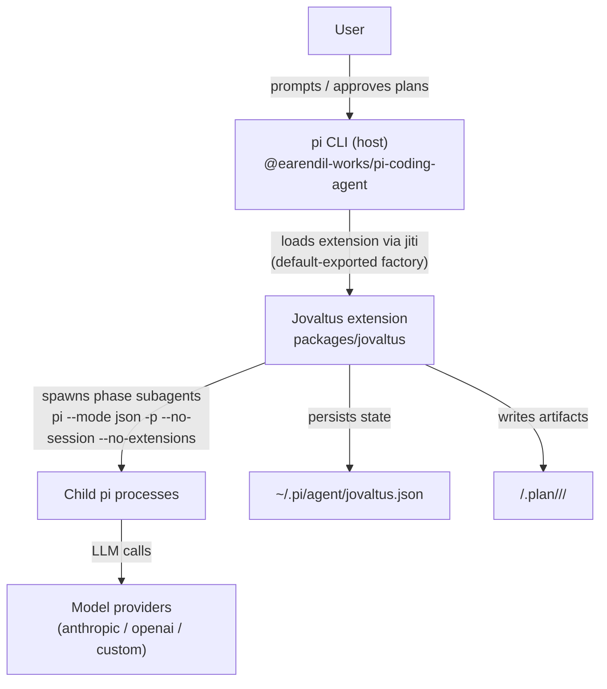
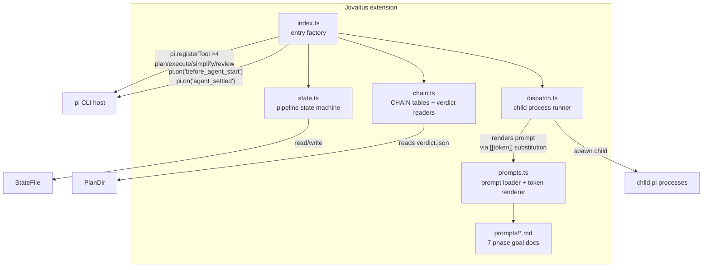

# Architecture

## System Context (C4 L1)

## Container Diagram (C4 L2)

## Data Flow — one tool invocation

1. User calls a tool (`plan` / `execute` / `simplify` / `review`) in the pi session.
2. `index.ts` handler validates args, computes the run directory (`<cwd>/.plan/<date>/<slug>/`), and calls `startPipeline` (`state.ts`) — persisted to `~/.pi/agent/jovaltus.json`.
3. For each phase in the chain (`chain.ts` CHAIN table), `dispatchPhase` renders the phase prompt (`prompts.ts` → `prompts/<phase>.md` with `[[token]]` substitution) and spawns an isolated child `pi --mode json -p --no-session --no-extensions` process (`dispatch.ts`).
4. The child runs with coding built-ins only (`read,bash,edit,write,grep,find,ls`), inheriting the parent's model/thinking level; its stdout JSONL is parsed for the final assistant text.
5. On child success the phase advances; `plan` runs prd→research→acceptance→tasks synchronously inside one tool call; `simplify`/`review` read the child-written `verdict.json`:
   - `pass` → finish pipeline, `done`.
   - `fix` → park in `*_waiting`, surface findings to the main agent.
6. `agent_settled` fires after the main agent's fixing turn: re-dispatches the reviewer; on another `fix` it wakes the main agent with `pi.sendUserMessage(findings)`. Loop continues until `pass` (no cap).

## Key Architectural Decisions

| Decision                                                                                   | Rationale                                                                                                                                                                               | Status |
| ------------------------------------------------------------------------------------------ | --------------------------------------------------------------------------------------------------------------------------------------------------------------------------------------- | ------ |
| Child pi process per phase (not in-process SDK session)                                    | Official subagent example pattern; isolates context windows; `--no-extensions` prevents recursive extension load                                                                        | Active |
| Default-exported entry factory                                                             | pi loader contract: `jiti.import(path, { default: true })` then `typeof factory === "function"` — the single exception to the repo's named-exports rule                                 | Active |
| State persisted to `~/.pi/agent/jovaltus.json`                                             | Cross-session resume; same location pattern as Hermes plugin's state file                                                                                                               | Active |
| No delegation tool in children                                                             | pi children have no `delegate_task`; execute phase completes the DAG itself instead of dispatching workers `[INFERRED — ported behavior, see packages/jovaltus/src/prompts/execute.md]` | Active |
| `agent_settled` + `pi.sendUserMessage()` replace Hermes `post_llm_call` + completion queue | pi's event model: settled fires after the agent's run ends; sendUserMessage wakes a new turn                                                                                            | Active |

## Deployment Topology

No deployment. The extension is loaded by pi at runtime via auto-discovery (`~/.pi/agent/extensions/`, `.pi/extensions/`, or `pi install`); there is no Docker, CI, or server component.

## How to Update

- New phase/tool or changed data flow → update diagrams + Data Flow section.
- New architectural decision → add row to the decisions table; mark inference with `[INFERRED]`.
