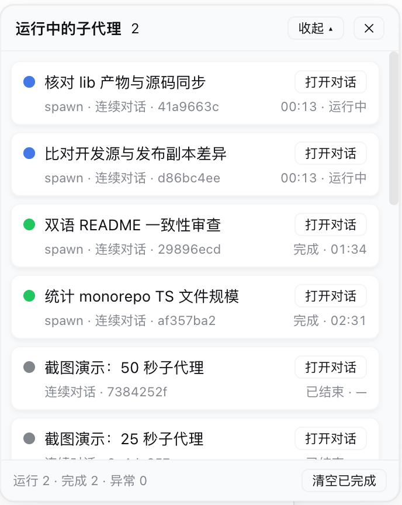

<h1 align="center">🤖 dsh-subagent-monitor</h1>

<p align="center">
  DeepSeek Harness (DSH) Web extension plugin · live subagent run monitor panel
  <br/>
  <a href="https://github.com/Mombrane/dsh-subagent-monitor/blob/master/LICENSE"></a>
  
  
</p>

[中文](README.md) | **English**

---

## ✨ What is it

Adds a **Subagents** entry at the bottom of the DSH Web sidebar and a card-style panel pinned to the **top-right** corner of the screen, showing the live run status of every subagent spawned from the current session.

```
┌─ Running subagents ────────────── [Collapse ▴] [✕] ┐
│ ┌───────────────────────────────────────────────┐ │
│ │ 🔵 Count TS files in ui dir        [Open chat] │ │
│ │    one-shot · 1a2b3c4d    running · 00:42     │ │
│ └───────────────────────────────────────────────┘ │
│ ┌───────────────────────────────────────────────┐ │
│ │ 🟢 Demo subagent: count file types [Open chat] │ │
│ │    spawn · 2b3c4d5e       done · 03:12        │ │
│ └───────────────────────────────────────────────┘ │
│  running 1 · done 1 · failed 0     [Clear done]  │
└───────────────────────────────────────────────────┘
```



## 🎯 Features

| Feature | Description |
| --- | --- |
| 🟢 Live status | running (🔵 blue breathing dot + stopwatch), done, failed, interrupted, token limit, rejected |
| 🃏 Card list | one rounded card per subagent; **Open chat** on the right, status and elapsed time on the second line |
| 🌲 Tree indent | grandchild subagents are indented to the right |
| 🔙 One-click back | inside a subagent session, the panel shows a **← Main session** button |
| 🔄 Refresh-proof | persistent composition row: the panel auto-recovers after page refresh / service restart |
| 📱 Mobile-friendly | hidden by default at ≤768px viewport; the sidebar entry still opens it manually |

## 📦 Installation

### Option A · npm (recommended, one line)

```bash
dsh plugin --profile <your-profile> add @leetoners/dsh-ui-subagent-monitor
```

> ✅ Published as `v0.1.0` (built and signed by GitHub Actions; SLSA provenance verifiable).

### Option B · Install from GitHub

```bash
dsh plugin --profile <your-profile> add github:Mombrane/dsh-subagent-monitor
# On first install, if prompted to allow build scripts, confirm in the profile's pnpm-workspace.yaml
```

Restart `dsh web` to take effect. This repository is both a **DSH client plugin** (`dsh.client`) and a **composition bundle** (`dsh.bundle` + `cordis.patch.yml`), shipped with a prebuilt `lib/`.

### Option C · Inline into the DSH source tree (for secondary development)

```bash
# 1. Copy this repo's src/ to <dsh>/packages/client/ui-subagent-monitor/
# 2. Add the dependency to <dsh>/packages/bundle/web-app/package.json
"@leetoners/dsh-ui-subagent-monitor": "workspace:*"
```

```yaml
# 3. <dsh>/packages/bundle/web-app/cordis.patch.yml (after the ui-subagent row)
- id: ui-subagent-monitor
  name: '@leetoners/dsh-ui-subagent-monitor'
```

```bash
# 4. Build + restart
pnpm install && pnpm --filter @leetoners/dsh-ui-subagent-monitor bundle
# restart dsh web
```

> Also add this package path to `references` in <dsh>/tsconfig.client.json, and point this
> package's `tsdown.config.ts` at the monorepo preset (`import { clientBundle } from '../tsdown.client.ts'`).

## 🏷️ Status legend

| Status | Meaning |
| --- | --- |
| 🔵 Running | in progress, blue breathing dot + live stopwatch |
| 🟢 Done | the panel witnessed a successful finish; shows elapsed time |
| ⚪ Ended | backfilled history row: created before a service restart, outcome not observed (success/failure unknown) |
| 🔴 Failed | ended in error |
| 🟠 Interrupted / token limit / rejected | aborted / hit the token cap / request rejected |

## ❓ FAQ

**Does the panel disappear on page refresh?** No. It is a persistent composition row; the panel auto-recovers on every page load.

**What is the difference between “Done” and “Ended”?** 🟢 is an outcome the panel observed live; ⚪ is history from before a service restart, outcome not observed.

**How much history does the panel keep?** At most 200 rows per root session; the oldest ended rows are evicted beyond that.

**Is it safe?** The polling route `/api/subagent-monitor/snapshot` binds to the loopback address with no auth; recommended for local / intranet use only.

## 🌐 Ecosystem

| Channel | Status |
| --- | --- |
| GitHub topics | `dsh-plugin`, `deepseek-harness` (auto-synced by Oh-My-DSH every 4 hours) |
| Oh-My-DSH catalog | PR [#8](https://github.com/like-study1/Oh-My-DSH/pull/8) pending maintainer merge |
| awesome-dsh-plugin | ✅ Listed (commit `c7ad36e9`, PR [#675](https://github.com/awesome-dsh-plugin/awesome-dsh-plugin/pull/675) merged) |

## 📋 Changelog

See [CHANGELOG.md](./CHANGELOG.md) for the full history. Current version **0.1.0** (aligned with `package.json`).

## 📖 Architecture

Design decisions (why persistent, why a custom polling route, event attribution model) and data-flow details: [ARCHITECTURE.md](./ARCHITECTURE.md).

## 📄 License

[MIT](./LICENSE) © Mombrane
